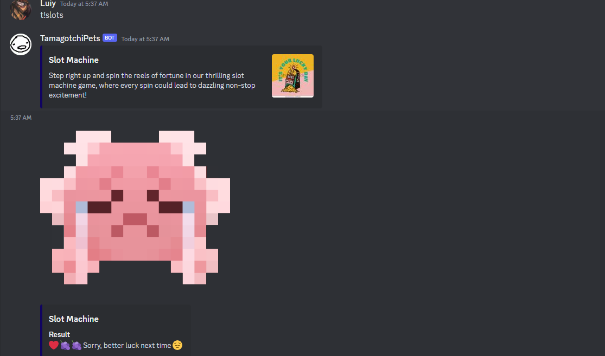
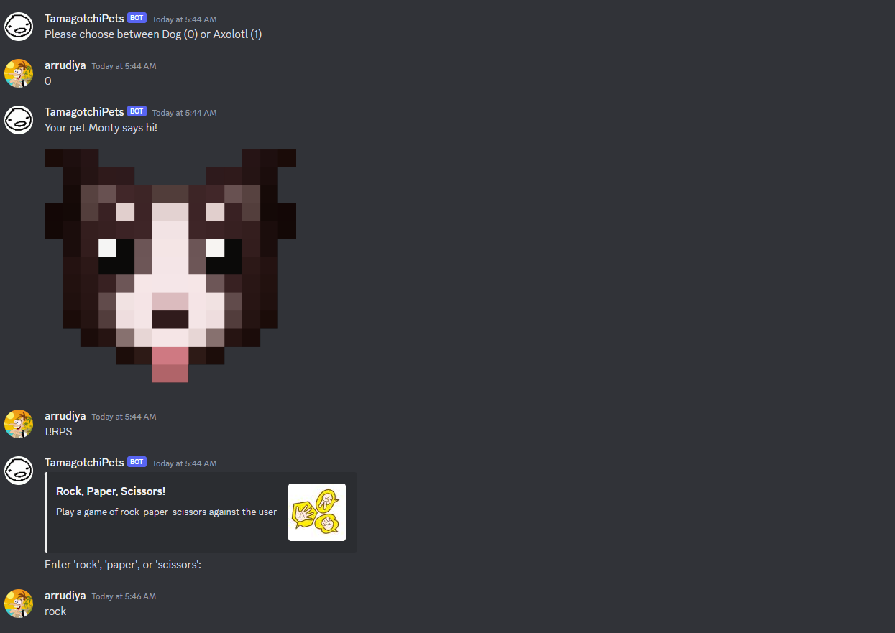
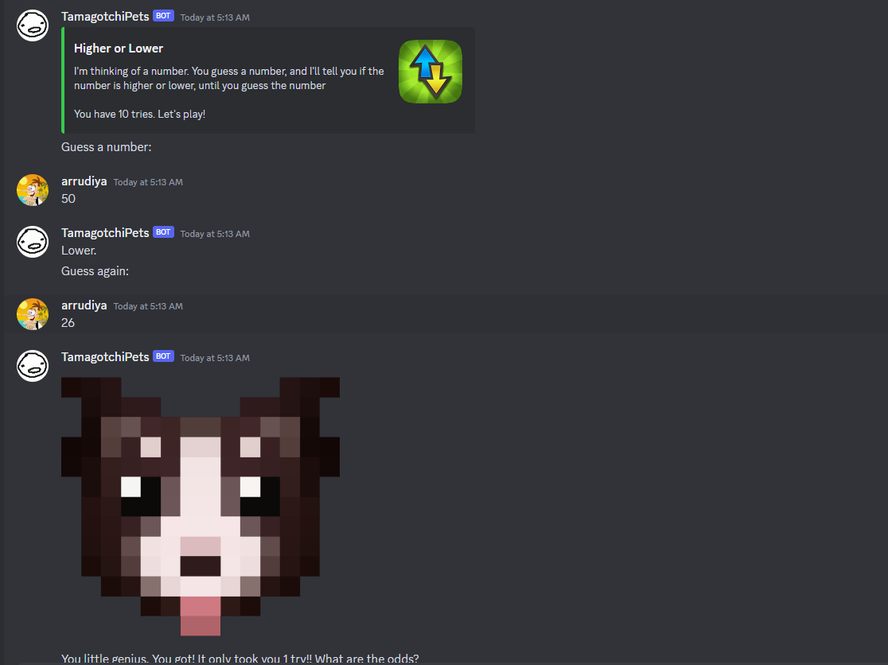

# Tamabotchi Bot

Everyone has heard of the cultural phenomenon of the Tamagotchi, and now, Tamabotchi Bot aims to bring the massively known virtual pet into a truly virtual form. Tamabotchi allows users to interact with a server-wide virtual pet, where they have the ability to care for it as a community.

## How Does Tamabotchi Work?

Tamabotchi has 3 main ways to interact with the bot. The most notable is playing games with the bot, such as Slots, Higher or Lower, and Rock Paper Scissors. The next way you can interact with the bot is by feeding it (make sure you make the right choice!). Finally, make sure you let your pet sleep once it's feeling a little tired. Keep this up, and you'll fulfill all your pet's desires!

## What Options Do I Have?

Tamabotchi Bot has two pets currently, Monty the Border Collie and Frankie the Axolotl. Make sure this is the first thing you do when using the bot! The following commands are:

- `t!choose` (Choose Your Pet)
- `t!RPS` (Rock Paper Scissors)
- `t!slots` (Play Slots)
- `t!HoL` (Play Higher or Lower)
- `t!feed` (Feed Your Pet)
- `t!nap` (Give Your Pet Some Rest!)
- `t!leaderboard` (Display Leaderboard)
- `t!status` (Check the Status of Your Virtual Pet)

## Notes

Tamabotchi currently depends on a guild name provided in a .env :(. It can only be run on one server at a time.

## Screenshots

